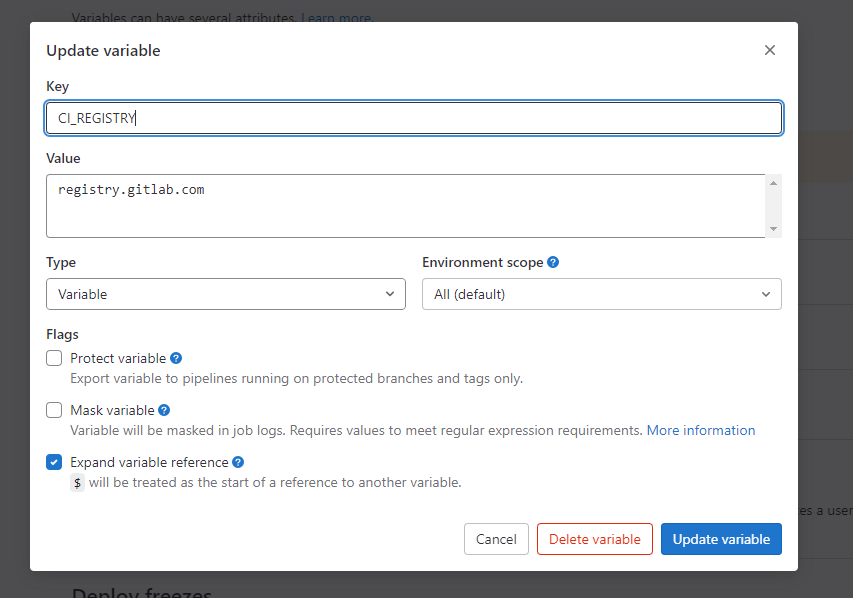

---


## Docker in docker

Run docker image for gitlab runner, build project image and push to gitlab in the gitlab runner docker.

In this way, in we change our docker file, we can automatically build and test it.


### `.gitlab-ci.yml` file

```yaml

image: docker

services:
  - docker:dind

variables:
  CI_IMAGE: $CI_REGISTRY_IMAGE/dave-test-image:latest
  GITLAB_REGISTRY_USERNAME: gitlab+deploy-token-1611692

build:
  stage: build
  only:
    variables:
      - $CI_COMMIT_MESSAGE =~ /build-image/
      - $CI_COMMIT_TAG =~ /build-image/
  before_script:
      - docker login $CI_REGISTRY -u $GITLAB_REGISTRY_USERNAME -p $GITLAB_REGISTRY_PASSWORD
  script:
    - docker build -t $CI_IMAGE .
    - docker push $CI_IMAGE

```


### Image build and upload


### Gitlab variable setting


**Need to uncheck `Protect varialbe` if testing ci/cd from unprotected branch**



---

<!--HugoNoteZhFlag-->

# Translated by ChatGTP

## 基本的 gitlab ci/cd 測試

### 安裝

只需按照 `Settings.CI/CD.Runners` 中的安裝指示，在您的服務器上設置即可。

### 設置檔案

在 git 項目的根目錄中創建 `.gitlab-ci.yml` 文件。

```yaml
stages:
  - build
  - deploy
build_job:
  stage: build
  script:
    - bash scripts/ci-test.sh
    - bash scripts/ci-test.sh
  tags:
    - tagA
deploy_job:
  stage: deploy
  script:
    - bash scripts/cd-test.sh
  tags:
    - tagA
```

> Runner 將執行階段，每個階段的任務將在每個階段中運行。

腳本示例，創建在 `scripts` 文件夾中。
```yaml
echo `date` >> /var/www/ci
```

在服務器上的文件 `ci` 中寫入內容。

**cd-test.sh**

```yaml
echo `date` >> /var/www/cd
```


---

<!--HugoNoteZhFlag-->

# Translated by ChatGTP

## Docker in docker

在 GitLab Runner 上運行 Docker 映像檔，建立專案映像檔，並將其推送到 GitLab 中的 Runner Docker 中。

透過這種方式，在我們更改 Docker 檔案時，我們可以自動建立並測試它。

### `.gitlab-ci.yml` 檔案

```yaml
image: docker

services:
  - docker:dind

variables:
  CI_IMAGE: $CI_REGISTRY_IMAGE/dave-test-image:latest
  GITLAB_REGISTRY_USERNAME: gitlab+deploy-token-1611692

build:
  stage: build
  only:
    variables:
      - $CI_COMMIT_MESSAGE =~ /build-image/
      - $CI_COMMIT_TAG =~ /build-image/
  before_script:
      - docker login $CI_REGISTRY -u $GITLAB_REGISTRY_USERNAME -p $GITLAB_REGISTRY_PASSWORD
  script:
    - docker build -t $CI_IMAGE .
    - docker push $CI_IMAGE
```

### 映像檔建立和上傳


### GitLab 變數設定


**在從未受保護的分支進行測試 CI/CD 時，必須取消勾選「保護變數」**


---

