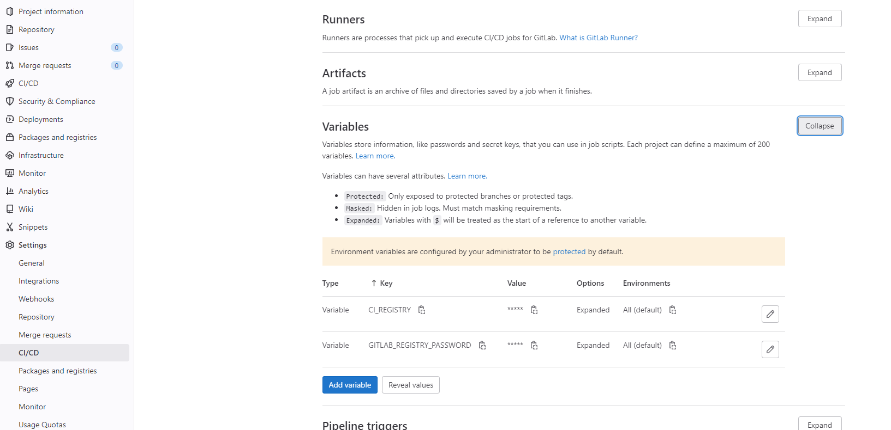
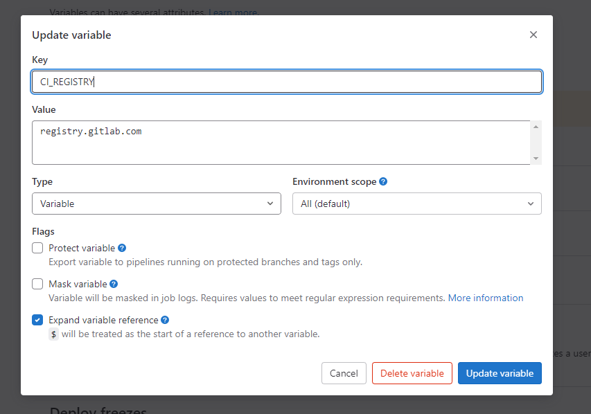

# 由 ChatGTP 翻譯

## Docker in docker

在 GitLab Runner 上執行 Docker 映像，建立專案映像，並將其推到 GitLab Runner Docker。

這樣，當我們更改 Docker 檔案時，我們可以自動建立並測試它。

### `.gitlab-ci.yml` 檔案

```yaml
image: docker

services:
  - docker:dind

variables:
  CI_IMAGE: $CI_REGISTRY_IMAGE/dave-test-image:latest
  GITLAB_REGISTRY_USERNAME: gitlab+deploy-token-1611692

build:
  stage: build
  only:
    variables:
      - $CI_COMMIT_MESSAGE =~ /build-image/
      - $CI_COMMIT_TAG =~ /build-image/
  before_script:
      - docker login $CI_REGISTRY -u $GITLAB_REGISTRY_USERNAME -p $GITLAB_REGISTRY_PASSWORD
  script:
    - docker build -t $CI_IMAGE .
    - docker push $CI_IMAGE
```

### 建立及上傳映像檔


### 設置 GitLab 變數



**從未受保護的分支進行 CI/CD 測試時，需要取消核取「保護變數」**

